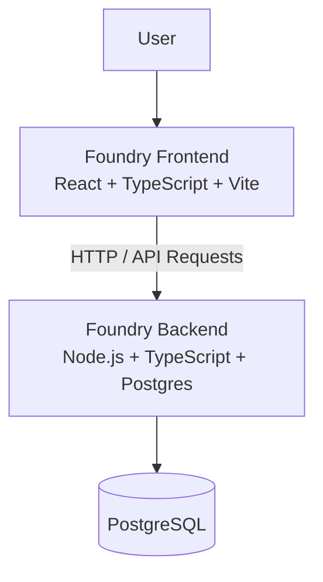

# Foundry

> **Build. Document. Connect. Discover.**

Foundry is a platform for people who build things.

It gives builders a place to create projects, document the journey from idea to launch, share progress, connect with other builders, discover communities, and find opportunities such as jobs, internships, hackathons, freelance work, and collaborations.

Foundry focuses on **the journey behind a project**, not just the finished product.

## Demo

Try the live application:

https://foundry-frontend-neon.vercel.app/

## Repositories

* **Frontend:** https://github.com/TechSage01/Foundry-Frontend
* **Backend:** https://github.com/TechSage01/Foundry-Backend

## What It Does

Foundry combines project building, social networking, and opportunity discovery.

### Projects

Users can:

* Create and manage projects
* Set a project status
* Document progress from idea to launch
* Create milestones
* Publish project updates
* Add project members
* Link external resources such as GitHub repositories, demos, websites, and documentation

Project statuses include:

* Idea
* Planning
* Building
* Testing
* Launching
* Completed
* Paused
* Archived

### Profiles

Profiles focus on what a person has built rather than behaving like a traditional résumé.

Users can showcase:

* Skills
* Experience
* Projects
* Posts
* Followers and following
* External links

### Social Feed

Users can follow people and projects and see useful building activity through:

* Project updates
* Posts
* Milestones
* Project launches
* Community discussions
* Opportunity announcements

### Opportunities

Foundry treats opportunities as a first-class feature.

Users can discover and publish:

* Jobs
* Internships
* Freelance work
* Hackathons
* Collaborations
* Open-source opportunities
* Co-founder opportunities
* Grants
* Competitions

Opportunities can include skills, location, remote/on-site status, compensation, deadlines, and application information.

### Communities

Communities bring builders together around interests such as development, AI, robotics, startups, open source, UI/UX, Go, and React.

### Messaging

Foundry supports communication between users through one-to-one, group, and project conversations.

### Discovery

Users can discover people, projects, communities, and opportunities through search and discovery.

## Important Design Decision

Foundry is **not GitHub**.

It does not store raw source code or provide Git repositories. Instead, builders document what they are building and link to external development resources when necessary.

The goal is to show:

> **Who built it → Why they built it → How it evolved → What they learned → Who contributed → Where it is going**

## Tech Stack

### Frontend

The frontend is a separate application:

* React
* TypeScript
* Vite
* Tailwind CSS
* React Router
* Redux Toolkit
* React Query

Frontend repository:

https://github.com/TechSage01/Foundry-Frontend

### Backend

The backend is a separate API service:

* Node.js
* Express
* TypeScript
* PostgreSQL
* Goose for database migrations

Backend repository:

https://github.com/TechSage01/Foundry-Backend

### Deployment

The frontend is deployed on Vercel.

Live application:

https://foundry-frontend-neon.vercel.app/

The backend repository contains the backend configuration and development setup.

## Architecture

Foundry is split into a frontend application and a backend API, with PostgreSQL serving as the primary database.



## How It Was Made

Foundry was designed around a simple idea: **projects should be first-class objects rather than something hidden behind a user's résumé or social profile.**

The application therefore centers its data and user experience around projects, project updates, milestones, teams, and the people following them.

The product also separates the social and professional sides of building. A user can document a project, meet other builders, find an opportunity, and potentially turn that interaction into collaboration.

A major product constraint was avoiding feature bloat. Foundry is not intended to become a replacement for GitHub, Slack, project-management tools, or recruitment platforms. Instead, it connects the context around those tools.

## Problems & Challenges

### Keeping the Product Focused

A platform combining projects, social features, communities, messaging, and opportunities can easily become bloated.

The solution was to keep the project journey at the center and treat other features as supporting systems.

### Showing Progress Instead of Just Results

Traditional portfolios mostly show finished work.

Foundry needed a way to show the process, so projects have updates, milestones, statuses, and a chronological journey.

### Avoiding Another Code-Hosting Platform

Storing source code would push Foundry toward becoming another GitHub.

Instead, Foundry stores project context and allows external repositories and resources to be linked.

### Balancing Professional and Social Design

The interface needed to feel credible enough for professional networking without becoming overly corporate, while still being approachable without feeling like a casual entertainment platform.

## Installation

Clone both repositories:

```bash
git clone https://github.com/TechSage01/Foundry-Frontend.git
git clone https://github.com/TechSage01/Foundry-Backend.git
```

### Frontend

```bash
cd Foundry-Frontend
npm install
npm run dev
```

The development server will print the local URL in the terminal.

Create the required environment variables according to the frontend repository's configuration.

### Backend

```bash
cd Foundry-Backend
npm install
```

Configure the backend environment variables, including the PostgreSQL database connection.

Run the database migrations with Goose according to the migration configuration in the backend repository.

Then start the API:

```bash
npm run dev
```

Check the backend repository for the exact environment variables, scripts, migration commands, and service configuration.

## Development

For local development, run the frontend and backend separately.

```text
Foundry Frontend
       |
       | API requests
       v
Foundry Backend
       |
       v
PostgreSQL
```

When making changes:

1. Start the PostgreSQL database.
2. Run the backend API.
3. Run the frontend development server.
4. Configure the frontend API URL to point to the local backend.
5. Run migrations whenever the database schema changes.

## Project Structure

Foundry is maintained as two repositories:

```text
Foundry
├── Foundry-Frontend
│   └── React / TypeScript application
│
└── Foundry-Backend
    └── Node.js / Express / TypeScript API
```

## Product Principles

* **Builders first** — prioritize people who build things.
* **Projects are first-class citizens** — projects should drive identity and discovery.
* **Show the journey** — capture progress, decisions, milestones, setbacks, and launches.
* **Professional without being corporate**.
* **Social without being childish**.
* **Discovery should lead to action**.

## MVP Scope

The MVP focuses on:

* Authentication
* Profiles
* Projects
* Project updates
* Milestones
* Project teams
* Social feed
* Follows
* Opportunities
* Applications/contact
* Messaging
* Discovery/search
* Notifications

Features such as raw source-code hosting, full Git hosting, video calls, advanced AI recommendations, payments, ATS functionality, enterprise administration, and advanced analytics are outside the initial MVP.

## Roadmap

### Phase 1 — Foundation

Authentication, profiles, projects, updates, milestones, feed, and follows.

### Phase 2 — Network

Communities, messaging, discovery, opportunities, and applications.

### Phase 3 — Collaboration

Project workspaces, channels, tasks, files, and deeper collaboration.

### Phase 4 — Intelligence

Personalized project discovery, opportunity recommendations, skill matching, and builder recommendations.

### Phase 5 — Platform

Organizations, hiring tools, marketplace capabilities, analytics, and premium features.

## License

See the individual frontend and backend repositories for their current license information.

---

**Foundry:** a place to show not just what you built, but the journey behind it.
